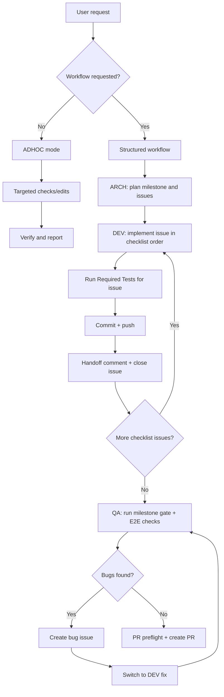
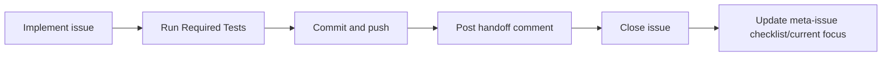

# SDLC Process Guide (Human-Oriented)

This guide explains how Helionyx delivery works end-to-end, why it is structured this way, and how to update process docs safely without creating drift.

## Why this process exists

The process is optimized for four outcomes:

1. **Feature delivery that actually works** (not just tests passing)
2. **Architectural integrity** (clear boundaries, explicit contracts)
3. **Durable recoverability** after context reset
4. **Token/context efficiency** (minimal rereads, low duplication)

## Operating modes at a glance

- **ADHOC**: quick operational help; no issue/PR ceremony unless requested
- **ARCH**: planning, boundaries, contracts, milestone decomposition
- **DEV**: scoped issue implementation with required test execution
- **QA**: runnable-system validation, bug-loop enforcement, PR readiness

## End-to-end flow

## Mandatory issue loop (structured workflow)

## Where each rule lives

Use this as the fast map instead of re-reading everything.

- **Precedence and conflict handling**: `SDLC/agent/SDLC_AGENT_AUTHORITY_MAP.md`
- **Startup/rehydration path**: `SDLC/agent/SDLC_AGENT_SESSION_BOOTSTRAP.md`
- **Execution loop and PR preflight**: `SDLC/agent/SDLC_AGENT_EXECUTION_RUNBOOK.md`
- **Repo-level hard rules**: `.github/copilot-instructions.md`
- **Workflow lifecycle**: `SDLC/WORKFLOW.md`
- **Mode constraints**: `SDLC/agent/modes/{architect,developer,qa}.agent.md`
- **Operational prompt starters**: `SDLC/human/SDLC_HUMAN_DRIVER_PROMPTS.md`
- **Durable process history**: `SDLC/SDLC_PROCESS_CHANGELOG.md`

## Why this produces productive work

- **Architecture quality**: ARCH mode owns boundaries/contracts; DEV cannot silently redesign.
- **Feature accuracy**: issues are atomic and acceptance-linked.
- **Test discipline**: each issue has explicit required tests; milestone has a test gate.
- **Reality checks**: QA validates runnable behavior and user interaction paths.
- **Durability**: commits + handoffs + closed issues + meta-issue focus enable clean resume.
- **Efficiency**: lean startup path and canonical-doc references reduce redundant context usage.

## How to update process docs safely

When changing process behavior, use this sequence:

1. Decide canonical owner doc for the rule.
2. Update that canonical doc first.
3. In other docs, prefer short references over duplicated long rule text.
4. Update templates/prompts only where operator behavior changes.
5. Add a dated entry to `SDLC/SDLC_PROCESS_CHANGELOG.md`.
6. Run a quick consistency check for stale references:
    - `rg "COMMIT_MESSAGE_TEMPLATE|COMMIT_MSG_TEMPLATE|SDLC_AGENT_EXECUTION_RUNBOOK|PR_REQUEST_TEMPLATE|PULL_REQUEST_TEMPLATE|docs/process" .github SDLC`

## Anti-drift checklist (quick)

- Are there conflicting instructions at the same precedence level?
- Is the issue source-of-truth rule still checklist-based?
- Does every issue still require explicit test commands?
- Does PR preflight still run before PR body publish/update?
- Are prompts concise and linked to canonical docs (not duplicating them)?
- Is the change recorded in `SDLC/SDLC_PROCESS_CHANGELOG.md`?
