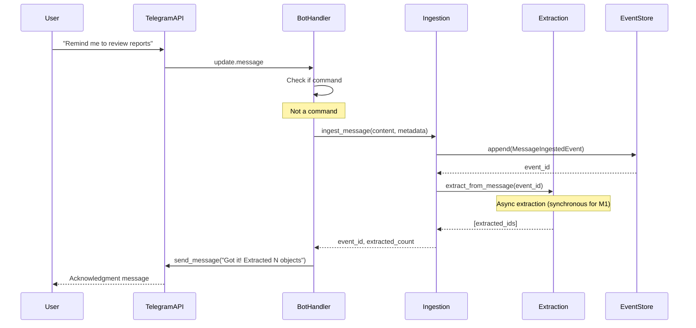
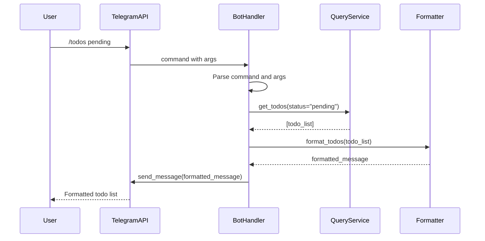
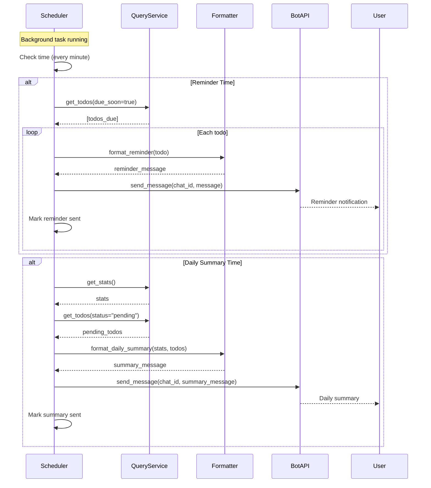

# ADR: Telegram Bot Architecture and Message Flow

**Status**: Proposed  
**Date**: February 10, 2026  
**Issue**: #12  
**Milestone**: M1

## Context

Milestone 1 requires Telegram integration as the primary interactive interface for Helionyx. Users need to query their todos/notes/tracks and receive push notifications, while the system must maintain its architectural principles.

### Requirements
- Interactive bot for queries (pull interactions)
- Push notifications for reminders and summaries
- Seamless message ingestion for conversational data
- Command structure for common operations
- Error handling and user-friendly feedback
- Single-user configuration for M1
- Integration with existing ingestion, extraction, and query services

### Constraints
- Telegram is an adapter, not core dependency (Project Charter)
- Bot must be stateless where possible (state in event log)
- Must handle Telegram rate limits gracefully
- Single-user bot (one chat ID, no multi-user)
- Polling mode acceptable (no webhook infrastructure needed)
- Must preserve human authority principle

---

## Decision

### 1. Bot Framework Selection

**Selected**: `python-telegram-bot` (v21+)

**Rationale**:
- Mature, actively maintained library (13k+ stars)
- Excellent async/await support
- Comprehensive Telegram Bot API coverage
- Strong error handling capabilities
- Good documentation and examples
- Supports both polling and webhooks

**Alternative Considered**: `aiogram`
- Modern and performant
- **Rejected**: Less established, smaller community, more opinionated architecture

**Installation**:
```bash
python-telegram-bot==21.0+
```

---

### 2. Architectural Pattern

**Adapter Layer Pattern**: Telegram is a thin translation layer.

```
┌─────────────────────────────────────────────────────┐
│                 Telegram Bot API                     │
└────────────────────┬────────────────────────────────┘
                     │
┌────────────────────▼────────────────────────────────┐
│              Telegram Bot Adapter                    │
│  ┌─────────────────────────────────────────────┐   │
│  │  Command Router                              │   │
│  │  - /start, /help, /todos, /notes, etc.      │   │
│  │  - Route to appropriate handler              │   │
│  └─────────────────────────────────────────────┘   │
│  ┌─────────────────────────────────────────────┐   │
│  │  Message Handler                             │   │
│  │  - Non-command messages → Ingestion          │   │
│  └─────────────────────────────────────────────┘   │
│  ┌─────────────────────────────────────────────┐   │
│  │  Notification Scheduler (background task)    │   │
│  │  - Check for reminders                       │   │
│  │  - Send daily summaries                      │   │
│  └─────────────────────────────────────────────┘   │
│  ┌─────────────────────────────────────────────┐   │
│  │  Formatters                                  │   │
│  │  - Convert objects → Telegram messages       │   │
│  └─────────────────────────────────────────────┘   │
└───────────┬──────────────────────┬──────────────────┘
            │                      │
    ┌───────▼─────────┐   ┌───────▼──────────┐
    │   Ingestion     │   │   Query Service  │
    │   Service       │   │                  │
    └─────────────────┘   └──────────────────┘
```

**Core Principles**:
- Bot has **no business logic** - only translation and routing
- All state lives in event log and projections
- Bot delegates to core services for all operations
- Formatters convert service responses to user-friendly messages

---

### 3. Command Structure

#### Query Commands (Pull Interactions)

| Command | Arguments | Description | Handler |
|---------|-----------|-------------|---------|
| `/start` | None | Welcome message, verify setup | `start_command` |
| `/help` | None | List available commands | `help_command` |
| `/todos` | `[status]` | List todos, optional filter | `todos_command` |
| `/notes` | `[search]` | List notes, optional search | `notes_command` |
| `/tracks` | None | List tracking items | `tracks_command` |
| `/stats` | None | System statistics | `stats_command` |

#### Future Commands (M2+)
- `/add <text>` - Quick add (detect type)
- `/done <id>` - Mark todo complete
- `/query <natural language>` - LLM-powered query

**Design Notes**:
- All commands stateless (no conversation context)
- Filters are simple positional arguments
- Error feedback for invalid arguments
- Help text embedded in command responses

---

### 4. Message Flow Patterns

#### Incoming Message Flow (Ingestion)



**Key Points**:
- Non-command messages go to ingestion service
- Extraction triggered synchronously for immediate feedback
- User gets acknowledgment with extraction count
- All data preserved in event log

#### Query Flow (User Pulls Data)



**Key Points**:
- Command parsed to extract filters
- Query service called with appropriate parameters
- Formatter converts data to Telegram markdown
- Response sent directly to user

#### Notification Flow (System Pushes)



**Key Points**:
- Scheduler runs as background task in bot process
- Checks every minute for notification conditions
- Queries projection database for due items
- Tracks sent notifications to avoid duplicates
- Uses same formatter utilities as query commands

---

### 5. Command Handler Implementations

#### /start Command

```python
async def start_command(update: Update, context: ContextTypes.DEFAULT_TYPE):
    """Welcome message and setup verification."""
    
    user = update.effective_user
    chat_id = update.effective_chat.id
    
    message = f"""
👋 Welcome to Helionyx, {user.first_name}!

I'm your personal decision and execution substrate.

I can help you:
• Track todos, notes, and things to monitor
• Query your data anytime
• Send you reminders and daily summaries

Try /help to see what I can do.
    """
    
    await update.message.reply_text(message.strip())
    
    # Log chat_id for configuration
    logger.info(f"User {user.id} ({user.username}) started bot. Chat ID: {chat_id}")
```

#### /help Command

```python
async def help_command(update: Update, context: ContextTypes.DEFAULT_TYPE):
    """Display available commands."""
    
    help_text = """
📚 *Available Commands*

*Queries*
• `/todos [status]` - List your todos
  Example: `/todos pending`
  
• `/notes [search]` - List your notes
  Example: `/notes meeting`
  
• `/tracks` - List tracking items

• `/stats` - System statistics

*Information*
• `/help` - Show this message
• `/start` - Welcome message

💡 Tip: You can also just send me messages and I'll extract todos, notes, and tracks automatically!
    """
    
    await update.message.reply_text(
        help_text.strip(),
        parse_mode='Markdown'
    )
```

#### /todos Command

```python
async def todos_command(update: Update, context: ContextTypes.DEFAULT_TYPE):
    """List todos with optional status filter."""
    
    # Parse optional status argument
    status = context.args[0] if context.args else None
    
    # Validate status
    valid_statuses = ['pending', 'in_progress', 'completed', 'cancelled']
    if status and status not in valid_statuses:
        await update.message.reply_text(
            f"❌ Invalid status: {status}\n"
            f"Valid options: {', '.join(valid_statuses)}"
        )
        return
    
    try:
        # Query service
        todos = await query_service.get_todos(status=status)
        
        # Format response
        if not todos:
            status_text = f" ({status})" if status else ""
            await update.message.reply_text(f"No todos found{status_text}.")
            return
        
        # Format and send
        formatted = format_todos_list(todos)
        await update.message.reply_text(formatted, parse_mode='Markdown')
        
    except Exception as e:
        logger.error(f"Error in todos_command: {e}", exc_info=True)
        await update.message.reply_text(
            "❌ Sorry, something went wrong. Please try again."
        )
```

#### /notes Command

```python
async def notes_command(update: Update, context: ContextTypes.DEFAULT_TYPE):
    """List notes with optional search."""
    
    # Parse optional search argument
    search = " ".join(context.args) if context.args else None
    
    try:
        # Query service
        notes = await query_service.get_notes(search=search)
        
        # Format response
        if not notes:
            search_text = f" matching '{search}'" if search else ""
            await update.message.reply_text(f"No notes found{search_text}.")
            return
        
        # Format and send
        formatted = format_notes_list(notes)
        await update.message.reply_text(formatted, parse_mode='Markdown')
        
    except Exception as e:
        logger.error(f"Error in notes_command: {e}", exc_info=True)
        await update.message.reply_text(
            "❌ Sorry, something went wrong. Please try again."
        )
```

#### /stats Command

```python
async def stats_command(update: Update, context: ContextTypes.DEFAULT_TYPE):
    """Display system statistics."""
    
    try:
        stats = query_service.get_stats()
        
        message = f"""
📊 *Helionyx Statistics*

*Objects*
• Todos: {stats.get('todos', 0)}
• Notes: {stats.get('notes', 0)}
• Tracks: {stats.get('tracks', 0)}
• Total: {stats.get('total_objects', 0)}

*System*
• Events: {stats.get('total_events', 'N/A')}
• Last rebuild: {stats.get('last_rebuild', 'Never')}
        """
        
        await update.message.reply_text(message.strip(), parse_mode='Markdown')
        
    except Exception as e:
        logger.error(f"Error in stats_command: {e}", exc_info=True)
        await update.message.reply_text(
            "❌ Sorry, something went wrong. Please try again."
        )
```

---

### 6. Message Handler (Non-Commands)

```python
async def handle_message(update: Update, context: ContextTypes.DEFAULT_TYPE):
    """Handle non-command messages (ingest and extract)."""
    
    message = update.message
    
    if not message.text:
        # Skip non-text messages for M1
        await message.reply_text("I can only process text messages for now.")
        return
    
    try:
        # Ingest message
        event_id = await ingestion_service.ingest_message(
            content=message.text,
            source=SourceType.TELEGRAM,
            source_id=str(message.message_id),
            author="user",
            conversation_id=str(update.effective_chat.id),
            metadata={
                "telegram_user_id": update.effective_user.id,
                "telegram_username": update.effective_user.username,
                "telegram_chat_id": update.effective_chat.id,
            }
        )
        
        # Trigger extraction (synchronous for M1)
        extracted_ids = await extraction_service.extract_from_message(event_id)
        
        # Acknowledge with count
        count = len(extracted_ids)
        if count > 0:
            await message.reply_text(
                f"✅ Got it! Extracted {count} object(s) from your message."
            )
        else:
            await message.reply_text(
                "✅ Message recorded. No objects extracted."
            )
        
    except Exception as e:
        logger.error(f"Error processing message: {e}", exc_info=True)
        await message.reply_text(
            "❌ Sorry, I couldn't process that message. Please try again."
        )
```

---

### 7. Notification Scheduler

#### Architecture

**Approach**: Background task within bot process using `application.create_task()`.

**Alternative Considered**: Separate scheduler process
- **Rejected for M1**: Adds complexity, shared state issues, unnecessary for single-user

#### Scheduler Implementation

```python
async def notification_scheduler(application: Application):
    """Background task for checking and sending notifications."""
    
    logger.info("Notification scheduler started")
    
    while True:
        try:
            # Check reminders
            await check_and_send_reminders(application.bot)
            
            # Check daily summary
            await check_and_send_daily_summary(application.bot)
            
        except Exception as e:
            logger.error(f"Error in notification scheduler: {e}", exc_info=True)
        
        # Sleep for 1 minute
        await asyncio.sleep(60)

async def check_and_send_reminders(bot: Bot):
    """Check for due todos and send reminders."""
    
    now = datetime.now()
    hour = now.hour
    
    # Only send reminders during reasonable hours
    if hour < 8 or hour > 21:
        return
    
    # Get todos due soon (next 24 hours)
    tomorrow = now + timedelta(hours=24)
    todos = await query_service.get_todos(
        status="pending"
    )
    
    # Filter to due soon
    due_soon = [
        t for t in todos 
        if t.get('due_date') and 
           parse_datetime(t['due_date']) <= tomorrow
    ]
    
    for todo in due_soon:
        # Check if already reminded today
        if await was_reminded_today(todo['object_id']):
            continue
        
        # Format and send reminder
        message = format_reminder(todo)
        await bot.send_message(
            chat_id=config.TELEGRAM_CHAT_ID,
            text=message,
            parse_mode='Markdown'
        )
        
        # Mark as reminded
        await mark_reminder_sent(todo['object_id'])

async def check_and_send_daily_summary(bot: Bot):
    """Send daily summary at configured time."""
    
    now = datetime.now()
    
    # Check if it's summary time (default: 8 PM)
    if now.hour != config.DAILY_SUMMARY_HOUR:
        return
    
    # Check if already sent today
    if await was_daily_summary_sent_today():
        return
    
    # Get stats and pending todos
    stats = query_service.get_stats()
    todos = await query_service.get_todos(status="pending")
    overdue = [t for t in todos if is_overdue(t)]
    
    # Format summary
    message = format_daily_summary(stats, todos, overdue)
    
    # Send
    await bot.send_message(
        chat_id=config.TELEGRAM_CHAT_ID,
        text=message,
        parse_mode='Markdown'
    )
    
    # Mark as sent
    await mark_daily_summary_sent()
```

#### Notification State Tracking

Uses SQLite projection database (notification_log table from schema):

```python
async def was_reminded_today(object_id: str) -> bool:
    """Check if reminder was sent today."""
    today = datetime.now().date()
    
    cursor = db.execute(
        "SELECT 1 FROM notification_log "
        "WHERE notification_type = ? AND object_id = ? AND DATE(sent_at) = ?",
        ("reminder", object_id, today.isoformat())
    )
    
    return cursor.fetchone() is not None

async def mark_reminder_sent(object_id: str):
    """Record reminder notification."""
    db.execute(
        "INSERT INTO notification_log (notification_type, object_id, sent_at) "
        "VALUES (?, ?, ?)",
        ("reminder", object_id, datetime.now().isoformat())
    )
    db.commit()

async def was_daily_summary_sent_today() -> bool:
    """Check if daily summary was sent today."""
    today = datetime.now().date()
    
    cursor = db.execute(
        "SELECT 1 FROM notification_log "
        "WHERE notification_type = ? AND DATE(sent_at) = ?",
        ("daily_summary", today.isoformat())
    )
    
    return cursor.fetchone() is not None

async def mark_daily_summary_sent():
    """Record daily summary notification."""
    db.execute(
        "INSERT INTO notification_log (notification_type, sent_at) "
        "VALUES (?, ?)",
        ("daily_summary", datetime.now().isoformat())
    )
    db.commit()
```

---

### 8. Message Formatters

#### Todo List Formatter

```python
def format_todos_list(todos: list[dict]) -> str:
    """Format todo list for Telegram display."""
    
    if not todos:
        return "No todos found."
    
    # Group by priority
    by_priority = {
        'urgent': [],
        'high': [],
        'medium': [],
        'low': []
    }
    
    for todo in todos:
        priority = todo.get('priority', 'medium')
        by_priority[priority].append(todo)
    
    # Build message
    lines = [f"📋 *Your Todos* ({len(todos)})\n"]
    
    priority_icons = {
        'urgent': '🔴',
        'high': '🟠',
        'medium': '🟡',
        'low': '🟢'
    }
    
    for priority in ['urgent', 'high', 'medium', 'low']:
        items = by_priority[priority]
        if not items:
            continue
        
        icon = priority_icons[priority]
        lines.append(f"\n{icon} *{priority.upper()}*")
        
        for todo in items:
            title = todo['title']
            due = format_due_date(todo.get('due_date'))
            due_text = f"\n  📅 {due}" if due else ""
            lines.append(f"• {title}{due_text}")
    
    return "\n".join(lines)

def format_due_date(due_date_str: Optional[str]) -> Optional[str]:
    """Format due date for display."""
    if not due_date_str:
        return None
    
    due = parse_datetime(due_date_str)
    now = datetime.now()
    
    if due.date() == now.date():
        return "Today"
    elif due.date() == (now + timedelta(days=1)).date():
        return "Tomorrow"
    elif due < now:
        days_ago = (now - due).days
        return f"{days_ago}d overdue"
    else:
        return due.strftime("%b %d")
```

#### Reminder Formatter

```python
def format_reminder(todo: dict) -> str:
    """Format reminder notification."""
    
    due = format_due_date(todo.get('due_date'))
    priority = todo.get('priority', 'medium')
    
    message = f"""
🔔 *Reminder*

{todo['title']}

📅 Due: {due}
Priority: {priority.capitalize()}
    """
    
    return message.strip()
```

#### Daily Summary Formatter

```python
def format_daily_summary(stats: dict, todos: list[dict], overdue: list[dict]) -> str:
    """Format daily summary notification."""
    
    today = datetime.now().strftime("%B %d, %Y")
    
    message = f"""
📊 *Daily Summary* - {today}

📋 *Todos*
• Pending: {len(todos)}
• Overdue: {len(overdue)}

📝 *System*
• Total objects: {stats.get('total_objects', 0)}
    """
    
    if overdue:
        message += "\n\n⚠️ *Overdue Items*"
        for todo in overdue[:3]:  # Show max 3
            message += f"\n• {todo['title']}"
        if len(overdue) > 3:
            message += f"\n• ... and {len(overdue) - 3} more"
    
    return message.strip()
```

---

### 9. Error Handling

#### Error Handler

```python
async def error_handler(update: Update, context: ContextTypes.DEFAULT_TYPE):
    """Global error handler."""
    
    logger.error(f"Update {update} caused error {context.error}", exc_info=context.error)
    
    # User-friendly error message
    if update and update.effective_message:
        await update.effective_message.reply_text(
            "❌ Sorry, something went wrong. Please try again or contact support."
        )
```

#### Rate Limiting

```python
from telegram.error import RetryAfter, TimedOut

async def send_with_retry(bot: Bot, chat_id: int, text: str, max_retries: int = 3):
    """Send message with retry on rate limit."""
    
    for attempt in range(max_retries):
        try:
            return await bot.send_message(chat_id, text)
            
        except RetryAfter as e:
            if attempt < max_retries - 1:
                logger.warning(f"Rate limited. Waiting {e.retry_after}s")
                await asyncio.sleep(e.retry_after)
            else:
                raise
                
        except TimedOut as e:
            if attempt < max_retries - 1:
                logger.warning(f"Timeout. Retrying...")
                await asyncio.sleep(2 ** attempt)
            else:
                raise
```

---

### 10. Bot Setup and Main

```python
# services/adapters/telegram/bot.py

import logging
from telegram import Update
from telegram.ext import (
    Application,
    CommandHandler,
    MessageHandler,
    filters,
)

from services.ingestion.service import IngestionService
from services.extraction.service import ExtractionService
from services.query.service import QueryService
from config import Config

logger = logging.getLogger(__name__)

# Initialize services (dependency injection)
ingestion_service: IngestionService = None
extraction_service: ExtractionService = None
query_service: QueryService = None

def create_application(config: Config) -> Application:
    """Create and configure Telegram bot application."""
    
    # Build application
    application = (
        Application.builder()
        .token(config.TELEGRAM_BOT_TOKEN)
        .build()
    )
    
    # Add command handlers
    application.add_handler(CommandHandler("start", start_command))
    application.add_handler(CommandHandler("help", help_command))
    application.add_handler(CommandHandler("todos", todos_command))
    application.add_handler(CommandHandler("notes", notes_command))
    application.add_handler(CommandHandler("tracks", tracks_command))
    application.add_handler(CommandHandler("stats", stats_command))
    
    # Add message handler (non-commands)
    application.add_handler(
        MessageHandler(filters.TEXT & ~filters.COMMAND, handle_message)
    )
    
    # Add error handler
    application.add_error_handler(error_handler)
    
    return application

async def start_bot(config: Config):
    """Start the Telegram bot."""
    
    logger.info("Starting Telegram bot...")
    
    # Create application
    application = create_application(config)
    
    # Start notification scheduler as background task
    if config.NOTIFICATIONS_ENABLED:
        application.create_task(notification_scheduler(application))
    
    # Start polling
    await application.run_polling(
        allowed_updates=Update.ALL_TYPES,
        drop_pending_updates=True
    )

if __name__ == "__main__":
    # Load configuration
    config = Config.from_env()
    
    # Run bot
    import asyncio
    asyncio.run(start_bot(config))
```

---

### 11. Configuration

```bash
# Telegram Bot
TELEGRAM_BOT_TOKEN=123456:ABC-DEF1234ghIkl-zyx57W2v1u123ew11
TELEGRAM_CHAT_ID=123456789  # Single user chat ID

# Notification Settings
NOTIFICATIONS_ENABLED=true
DAILY_SUMMARY_HOUR=20  # 8 PM
REMINDER_WINDOW_START=8  # 8 AM
REMINDER_WINDOW_END=21  # 9 PM
REMINDER_ADVANCE_HOURS=24  # Remind 24h before due

# Bot Behavior
TELEGRAM_POLLING_TIMEOUT=30
TELEGRAM_MAX_RETRIES=3
```

**Setup Instructions**:
1. Create bot via @BotFather on Telegram
2. Get bot token
3. Start conversation with bot
4. Get chat ID (logged on /start command)
5. Add credentials to .env

---

### 12. Service Structure

```
services/adapters/telegram/
    __init__.py
    bot.py                  # Main bot setup and runner
    handlers.py             # Command handler implementations
    message_handler.py      # Non-command message processing
    formatters.py           # Message formatting utilities
    notifications.py        # Notification logic (reminders, summaries)
    scheduler.py            # Background notification scheduler
    errors.py               # Error handling utilities
```

---

### 13. State Management

**Stateless Design**: No conversation state for M1.

- All commands are single-turn
- No multi-step dialogs
- No user preferences stored in bot
- State lives in event log and projections

**Future (M2+)**: Add ConversationHandler if multi-turn flows needed.

---

### 14. Rate Limiting and Throttling

**Telegram Limits**:
- 30 messages/second across all users
- 1 message/second to same user
- 20 messages/minute to same group

**Single-User Approach**:
- Simple sleep-based throttling sufficient
- No sophisticated queue needed
- Retry with backoff on rate limit errors

**Implementation**:
```python
import asyncio
from datetime import datetime, timedelta

class SimpleThrottler:
    def __init__(self, delay: float = 0.05):
        self.delay = delay
        self.last_send = None
    
    async def throttle(self):
        """Ensure minimum delay between sends."""
        if self.last_send:
            elapsed = (datetime.now() - self.last_send).total_seconds()
            if elapsed < self.delay:
                await asyncio.sleep(self.delay - elapsed)
        self.last_send = datetime.now()
```

---

### 15. Testing Strategy

**Unit Tests** (Mock Telegram API):
```python
from unittest.mock import AsyncMock
from telegram import Update, Message

@pytest.mark.asyncio
async def test_todos_command():
    # Mock update
    update = AsyncMock(spec=Update)
    update.message = AsyncMock(spec=Message)
    context = AsyncMock()
    context.args = ["pending"]
    
    # Mock query service
    query_service.get_todos = AsyncMock(return_value=[
        {"title": "Test todo", "status": "pending"}
    ])
    
    # Execute
    await todos_command(update, context)
    
    # Verify
    update.message.reply_text.assert_called_once()
```

**Integration Tests** (Real Bot in Test Mode):
- Requires test bot token
- Automated message sending and response verification
- Manual testing with real account

**Manual Testing Checklist**:
- [ ] /start command responds
- [ ] /help shows all commands
- [ ] /todos lists todos
- [ ] /todos pending filters correctly
- [ ] /notes with search works
- [ ] /stats shows correct counts
- [ ] Non-command messages get acknowledged
- [ ] Reminders send at correct time
- [ ] Daily summary sends at configured time
- [ ] Error messages display correctly

---

## Consequences

### Positive
- ✅ Clean adapter pattern maintains architectural boundaries
- ✅ Stateless design simplifies implementation
- ✅ Background scheduler enables push notifications
- ✅ Single-user configuration is simple and sufficient
- ✅ Polling mode requires no infrastructure
- ✅ Extensible command structure

### Negative
- ⚠️ Polling is less efficient than webhooks (but acceptable for single-user)
- ⚠️ Background task in same process (but simpler for M1)
- ⚠️ No conversation state (limits UX sophistication)

### Risks
- **Bot Token Exposure**: Store securely, never commit
  - Mitigation: .env file, .gitignore
- **Rate Limiting**: Could hit limits with bulk operations
  - Mitigation: Retry logic, throttling
- **Single Point of Failure**: Bot process must stay running
  - Mitigation: Systemd/supervisor for auto-restart

---

## Implementation Checklist

- [ ] Install python-telegram-bot library
- [ ] Create bot framework setup in `bot.py`
- [ ] Implement command handlers in `handlers.py`
- [ ] Implement message handler in `message_handler.py`
- [ ] Create formatters in `formatters.py`
- [ ] Implement notification scheduler in `scheduler.py`
- [ ] Add notification state tracking to query service
- [ ] Create `scripts/run_telegram_bot.py` entry point
- [ ] Update `Makefile` with `make telegram` target
- [ ] Add Telegram configuration to `.env.example`
- [ ] Update `docs/ARCHITECTURE.md` with adapter section
- [ ] Create setup instructions in README
- [ ] Write unit tests for handlers
- [ ] Write integration tests
- [ ] Manual testing with real bot

---

## Related Issues

- **Blocks**: #13 (Implement Telegram Bot Commands and Handlers), #16 (Implement Reminder and Notification Scheduling)
- **Related**: #9 (Milestone 1 Meta-Issue), #14 (SQLite Persistence)

---

## Approval

- [ ] Architect reviewed
- [ ] Command structure validated
- [ ] Message flows verified
- [ ] Ready for developer implementation

