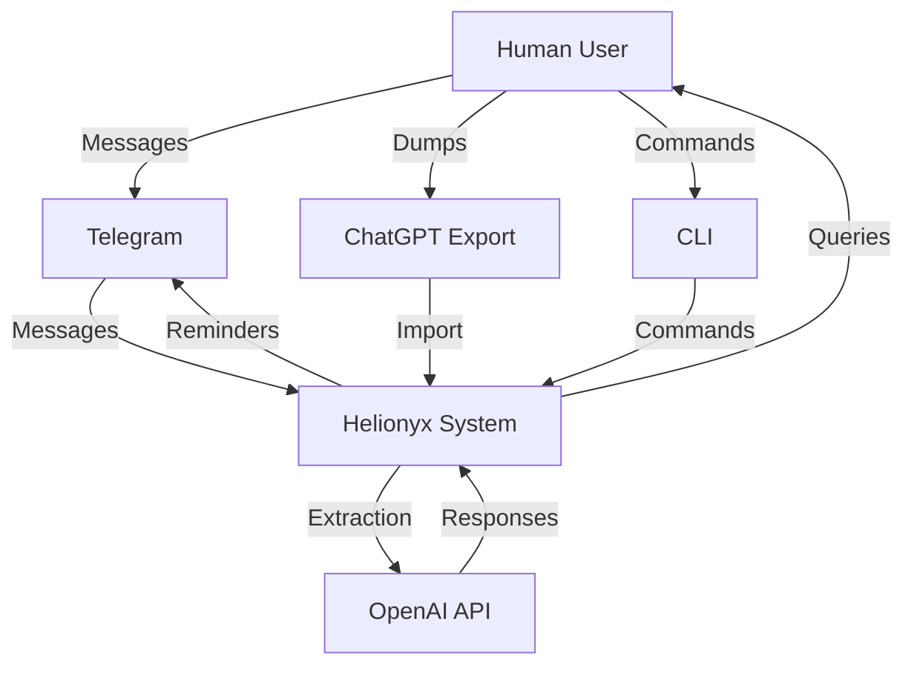
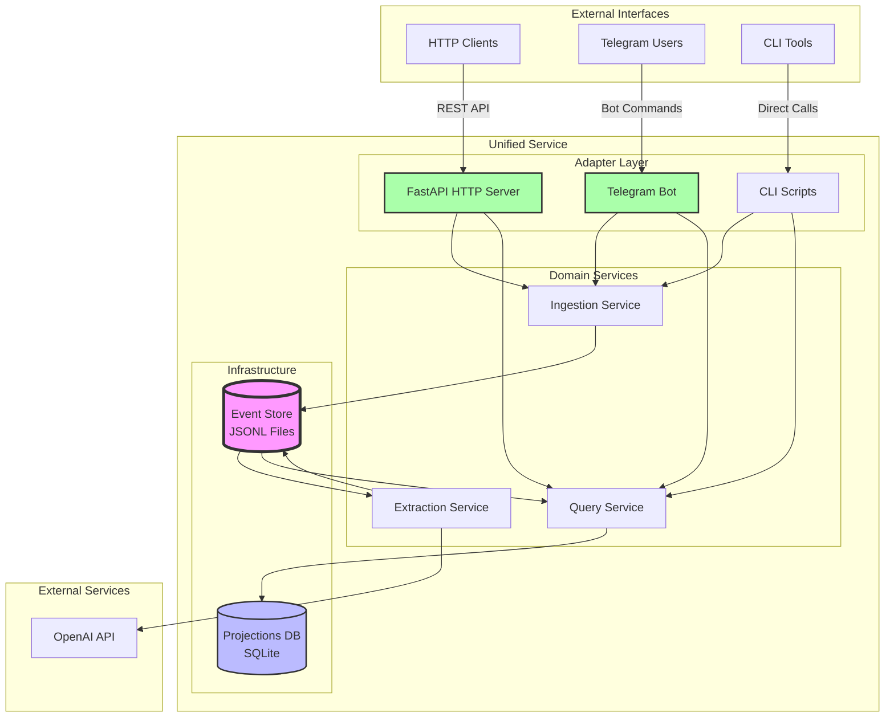
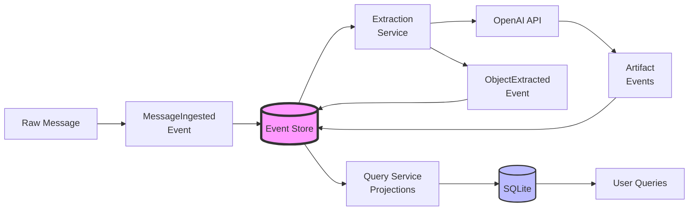
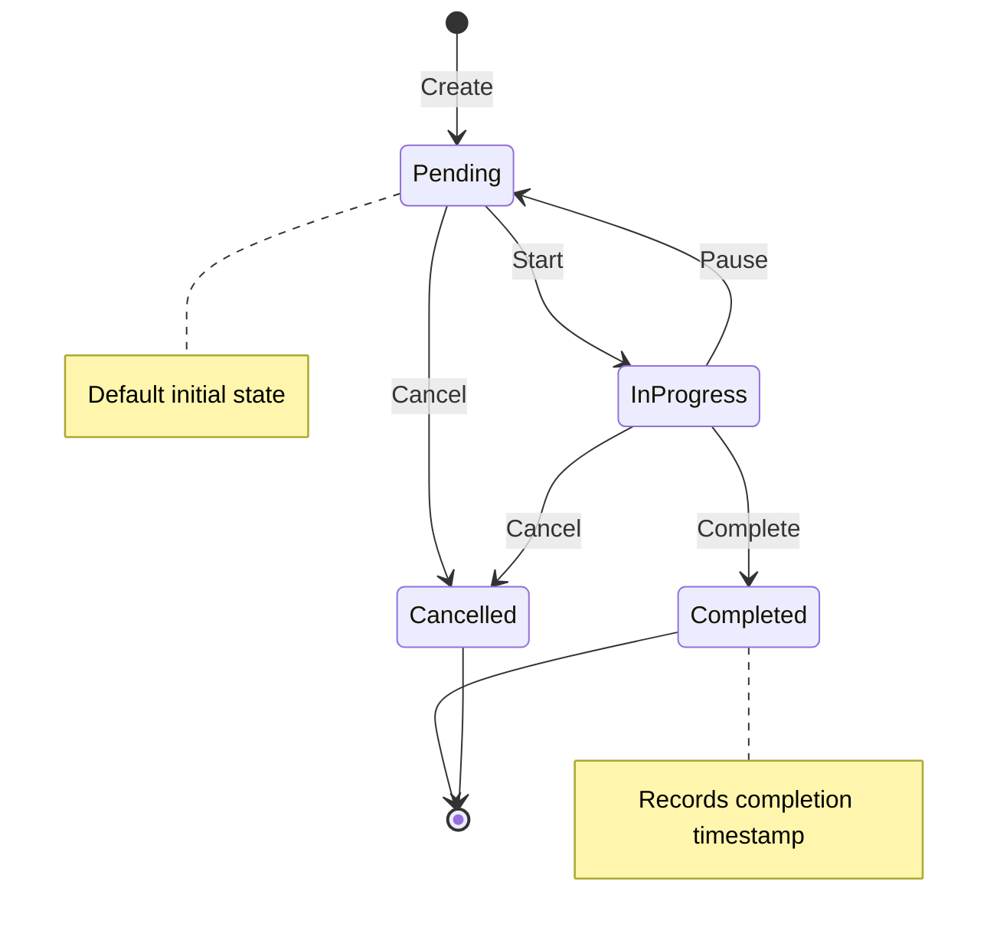
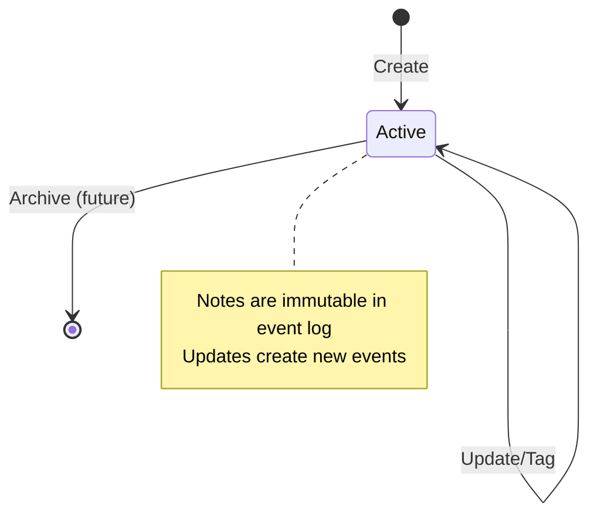
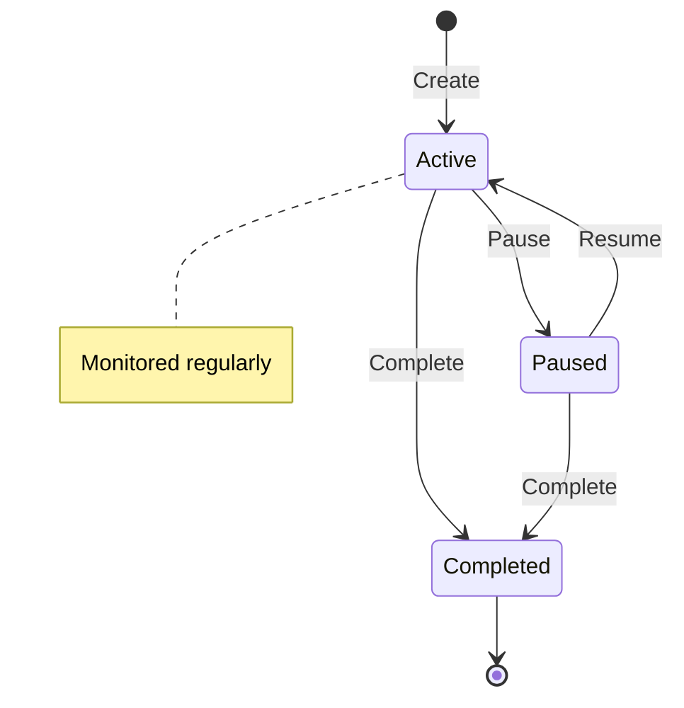
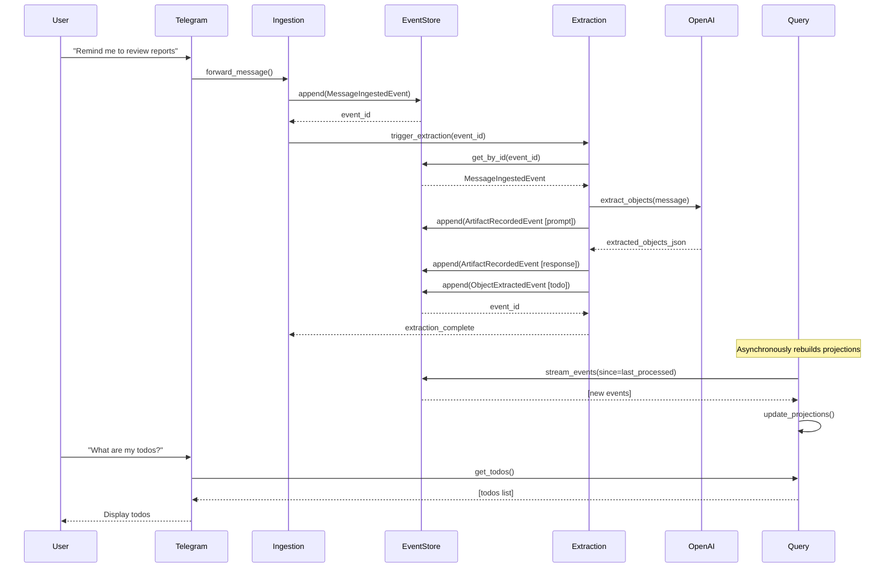
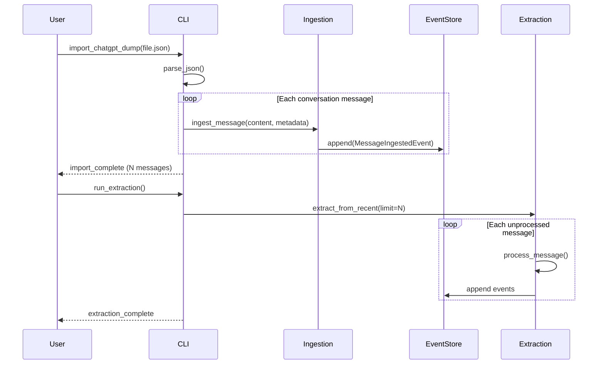

# Helionyx Architecture

**Version**: 0.2 (Milestone 2)  
**Last Updated**: February 11, 2026  
**Status**: Service Model Operational

## Overview

Helionyx is a personal decision and execution substrate built on an append-only event log foundation. It records, interprets, and surfaces decisions from conversational data while maintaining explicit human authority and full traceability.

### Core Principles

1. **Append-only event log** - Immutable source of truth
2. **Explicit contracts** - Services interact through defined interfaces
3. **Human authority** - LLMs are tools, not autonomous agents (within bounded surfaces)
4. **Durable artifacts** - All reasoning and decisions are recorded
5. **Service-oriented monorepo** - Independently testable and evolvable components
6. **Environment-aware configuration** - Separate dev/staging/live configurations (M2+)

---

## System Context



**External Actors:**
- **Human User** - Source of authority, primary actor
- **ChatGPT Export** - Historical conversation data (bootstrap)
- **Telegram** - Active conversational interface
- **OpenAI API** - LLM for extraction and summarization

---

## Configuration Management (M2+)

### Environment-Aware Configuration

Helionyx supports three distinct environments with separate configurations:

- **dev** - Development environment (verbose logging, mock LLM optional)
- **staging** - Pre-production testing (production-like but isolated data)
- **live** - Production environment (strict error handling, cost controls)

**Configuration Loading Strategy:**
1. Load base `.env` file (if exists)
2. Overlay environment-specific `.env.{ENV}` file (if exists)
3. Environment variables override file values

**Usage:**
```bash
make run               # Default: dev
make run ENV=staging   # Staging environment
make run ENV=live      # Live environment
```

**Configuration Variables:**
- Storage paths (event store, projections DB)
- OpenAI API credentials and limits
- Telegram bot credentials
- Notification settings
- Logging levels per environment

See `.env.template` for complete configuration documentation.

---

## Service Architecture

### Component Diagram



### Service Runner Model (M2+)

Helionyx operates as a **unified long-running service** that combines:
- FastAPI HTTP server for API endpoints
- Telegram bot adapter (optional, config-driven)
- Background task management (scheduling, notifications)
- Coordinated service lifecycle (startup, shutdown)

**Key Features:**
- Single process with asyncio-based concurrency
- Environment-aware configuration (dev/staging/live)
- Graceful startup and shutdown with resource cleanup
- Health and readiness endpoints for monitoring
- Integrated logging and error handling

**Entry Point:** `services/api/runner.py` using `make run ENV=<env>`

### Service Responsibilities

#### Event Store
**Responsibility**: Append-only event persistence  
**Technology**: File-based JSONL  
**Contract**: `EventStoreProtocol`

- Append events atomically
- Retrieve by ID, type, time range
- Stream events for processing
- **Never** modifies existing events

**Rationale**: File-based for simplicity, inspectability, and zero external dependencies. Sufficient for single-user use case.

---

#### Ingestion Service
**Responsibility**: Input normalization and recording  
**Technology**: Python service  
**Contract**: N/A (entry point)

- Accept inputs from ChatGPT dumps, Telegram, CLI
- Normalize to standard message format
- Record as `MessageIngestedEvent`
- Preserve all raw data as artifacts
- Trigger extraction (synchronously for M0)

**Source Adapters:**
- ChatGPT dump parser (JSON)
- Telegram bot handler
- CLI command processor

---

#### Extraction Service
**Responsibility**: LLM-based object extraction  
**Technology**: Python service + OpenAI SDK  
**Contract**: `ExtractionServiceProtocol`

- Read messages from event log
- Construct prompts for LLM
- Extract structured objects (Todo, Note, Track)
- Record LLM prompts and responses as artifacts
- Write `ObjectExtractedEvent` to event log

**Extraction Logic:**
- Stateless (state comes from event log)
- Prompt engineering for object detection
- Confidence scoring (optional)
- Can be triggered on-demand or via event stream

**LLM Integration (M1+):**
- Uses `LLMServiceProtocol` abstraction
- OpenAI implementation via `OpenAILLMService`
- All LLM interactions recorded as artifacts (prompts and responses)
- Error handling with exponential backoff and graceful degradation
- Rate limiting via token bucket algorithm
- Cost tracking and daily limits
- See `docs/ADR_M1_LLM_INTEGRATION.md` for detailed architecture

---

#### Query Service
**Responsibility**: Queryable projections  
**Technology**: Python service + SQLite  
**Contract**: `QueryServiceProtocol`

- Build projections from event log
- Provide query operations (todos, notes, tracks)
- Support filtering, search, tags
- Trigger push notifications based on rules (M1+)

**Projection Strategy:**
- Derived from event log (can rebuild)
- SQLite for pragmatic querying
- Eventual consistency with event log
- Periodic rebuild as needed

**Persistence (M1+):**
- Single SQLite database: `./data/projections/helionyx.db`
- Schema includes todos, notes, tracks, metadata tables
- Full projection rebuild from event log
- Incremental updates for running system
- See `docs/ADR_M1_SQLITE_PERSISTENCE.md` for detailed design
- Schema definition: `services/query/schema.sql`

---

### Interface Adapters

Thin translation layers between external systems and core services. **Contain no business logic**.

#### FastAPI HTTP API (M2+)

**Responsibility**: RESTful adapter layer for HTTP access  
**Technology**: FastAPI + Uvicorn  
**Location**: `services/api/`

**Endpoints:**
- `GET /health` - Service health check
- `GET /health/ready` - Readiness probe (DB connectivity)
- `POST /api/v1/ingest/message` - Ingest a new message
- `GET /api/v1/todos` - Query todos (with filters)
- `GET /api/v1/notes` - Query notes (with search)
- `GET /api/v1/tracks` - Query tracking items
- `GET /api/v1/stats` - System statistics

**Design Principles:**
- Strictly adapter layer - no domain logic
- Services injected via lifespan context manager
- Pydantic models for request/response validation
- Standard HTTP status codes and error handling
- Environment-aware startup/shutdown

**Lifecycle Management:**
- FastAPI lifespan events manage service initialization
- All services initialized once at startup
- Database connections opened and closed cleanly
- Telegram bot started as background asyncio task
- Graceful shutdown on SIGTERM/SIGINT

**Configuration:**
- Environment-specific `.env.{dev|staging|live}` files
- Loaded via `Config.from_env(ENV)` at startup
- See `.env.template` for all configuration variables

#### CLI Adapter

**Responsibility**: Direct command-line interaction  
**Technology**: Python scripts  
**Location**: `scripts/`

- **CLI Adapter**: Direct command-line interaction (development)
- **HTTP API**: RESTful endpoints (future)
- **Telegram Bot**: Active conversation interface (M1)

Adapters contain no business logic, only:
- Protocol translation
- Authentication/authorization (future)
- Error handling and user feedback

**Telegram Bot (M1+)**:
- Primary interactive interface for queries and notifications
- Uses python-telegram-bot framework (v21+)
- Stateless adapter pattern - no business logic in bot
- Command handlers for queries (/todos, /notes, /tracks, /stats)
- Message ingestion for conversational data
- Background scheduler for push notifications (reminders, daily summaries)
- Notification state tracked in projection database
- Single-user configuration (one chat ID)
- See `docs/ADR_M1_TELEGRAM_ARCHITECTURE.md` for detailed design

---

## Data Architecture

### Event Schema
All events extend `BaseEvent`:

```python
{
    "event_id": UUID,
    "event_type": EventType,
    "timestamp": datetime,
    "metadata": dict
}
```

**Event Types:**
- `MESSAGE_INGESTED` - Raw user or assistant message
- `ARTIFACT_RECORDED` - LLM prompt, response, or summary
- `OBJECT_EXTRACTED` - Structured todo, note, or track
- `DECISION_RECORDED` - Decision record (future)

See `shared/contracts/events.py` for full schemas.

### Object Schema
Extracted objects conform to:

```python
{
    "object_id": UUID,
    "object_type": ObjectType,  # todo, note, track
    "created_at": datetime,
    "source_event_id": UUID,
    # Type-specific fields
}
```

See `shared/contracts/objects.py` for full details.

### Data Flow Diagram



---

## State Management

### Object Lifecycle Diagrams

#### Todo State Machine



#### Note Lifecycle



#### Track State Machine



---

## Key Flows

### Canonical Flow: Message to Extracted Object



### ChatGPT Dump Import Flow



---

## Technology Stack

| Component | Technology | Version | Rationale |
|-----------|-----------|---------|-----------|
| Language | Python | 3.11+ | Project default, rich ecosystem |
| API Framework | FastAPI | 0.115+ | Modern, async, auto-docs |
| Validation | Pydantic | 2.9+ | Type safety, schemas |
| Event Storage | JSONL Files | - | Simple, inspectable, durable |
| Projections | SQLite | 3.x | Embedded, zero-config, reliable |
| LLM Client | OpenAI SDK | 1.54+ | Primary provider for M1 |
| Testing | pytest | 8.3+ | Standard Python testing |
| Code Quality | black, ruff, mypy | Latest | Linting and type checking |

---

## Design Decisions

### 1. File-Based Event Store

**Decision**: Use append-only JSONL files for event storage

**Rationale**:
- ✅ Simple implementation
- ✅ Human-inspectable
- ✅ No external dependencies
- ✅ Sufficient for single-user throughput
- ✅ Can migrate to DB later if needed

**Trade-offs**:
- Slower for large-scale queries (mitigated by projections)
- No ACID transactions across events (acceptable for append-only)
- File system limits (not a concern for personal use)

---

### 2. Synchronous Service Interaction (M0)

**Decision**: Services call each other directly (not async messaging)

**Rationale**:
- ✅ Simpler for M0 scope
- ✅ Easier to debug and reason about
- ✅ No additional infrastructure (message queue)
- ✅ Can evolve to async later

**Trade-offs**:
- Services more tightly coupled at runtime
- Less resilient to service failures
- Lower throughput ceiling

**Future**: Add message queue (Redis, RabbitMQ) if async needed

---

### 3. SQLite for Projections

**Decision**: Use SQLite for queryable read models

**Rationale**:
- ✅ Embedded (no server)
- ✅ Full SQL capability
- ✅ Battle-tested reliability
- ✅ Easy backup and inspection

**Trade-offs**:
- Single-writer limitation (not a problem for personal use)
- Less suitable for distributed systems

---

### 4. Python Across All Services

**Decision**: Pure Python stack (no polyglot)

**Rationale**:
- ✅ Single language reduces complexity
- ✅ Easier for single developer / agent coordination
- ✅ Rich ecosystem for LLM, data, APIs
- ✅ Matches project defaults

---

## Configuration Management

### Environment Variables
- `OPENAI_API_KEY` - Required for extraction
- `TELEGRAM_BOT_TOKEN` - Required for Telegram (M1)
- `EVENT_STORE_PATH` - Event log directory
- `PROJECTIONS_DB_PATH` - SQLite database path
- `LOG_LEVEL` - Logging verbosity
- `ENVIRONMENT` - dev, staging, production

### Files
- `.env` - Local development config (gitignored)
- `.env.example` - Template for required vars

---

## Testing Strategy

### Unit Tests
- Contract/schema validation
- Service logic in isolation
- Mock external dependencies

### Integration Tests
- Service-to-service interactions
- Event store read/write
- Projection rebuilding

### End-to-End Tests
- Full flow from input to query
- Walking skeleton exercised
- CLI commands

---

## Deployment Model (Current)

**M0/M1**: Local development only

```
User Machine
├── Python 3.11+ environment
├── Event logs (./data/events/)
├── Projections DB (./data/projections/helionyx.db)
└── Services run locally
```

**Future** (M2+): Containerized or cloud deployment
- Docker Compose for local dev
- Cloud hosting for production
- Service separation as needed

---

## Monitoring and Observability

**M0**: Basic logging to stdout/files

**M1+**:
- Structured logging (JSON)
- Event log inspection tools
- Projection lag monitoring
- LLM API usage tracking

---

## Security Considerations

**M0/M1 - Single User**:
- API keys in environment (not in code)
- Local file permissions
- No network exposure

**Future - Multi-User**:
- Authentication required
- Authorization per user
- Data isolation
- API rate limiting

---

## Scalability Considerations

**Current Design Limits**:
- Single user: thousands of messages per day (sufficient)
- Event store: millions of events (years of personal use)
- SQLite: acceptable for < 100GB (far beyond personal use)

**If Scaling Needed**:
- Event store → PostgreSQL with partitioning
- Message queue for async processing
- Read replicas for projections
- Service separation and independent scaling

**Not a concern for M0/M1 scope.**

---

## Future Evolution Paths

### Milestone 1
- Telegram integration
- ChatGPT dump import
- Basic object extraction
- Query capabilities

### Milestone 2+ (Non-binding)
- Native chat UI
- Richer decision models
- Policy and rule engine
- Multi-agent orchestration
- External integrations (email, calendar)
- Multi-user support

---

## Appendix: Architectural Review Checklist

When reviewing changes or considering evolution:

- [ ] Does it preserve the append-only event log?
- [ ] Are service boundaries respected?
- [ ] Are contracts explicit and versioned?
- [ ] Does it maintain human authority?
- [ ] Is state durable and recoverable?
- [ ] Can services be tested independently?
- [ ] Is it pragmatic for current needs (not over-engineered)?
- [ ] Does it enable future evolution without rewrite?

---

## Document History

| Version | Date | Author | Changes |
|---------|------|--------|---------|
| 0.1 | 2026-02-10 | Architect Agent | Initial architecture baseline for Milestone 0 |

