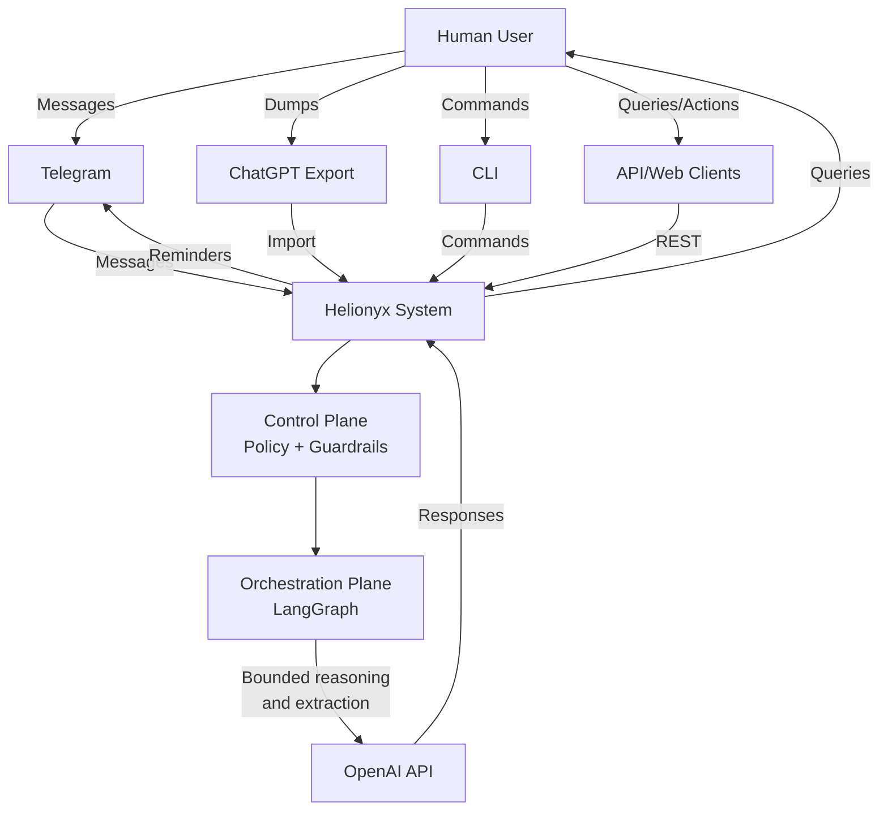
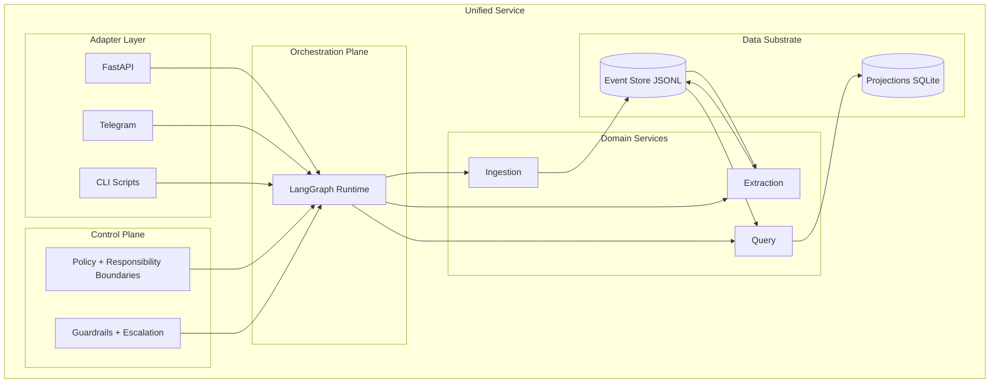

# Helionyx Architecture

**Version**: 0.7 (M12 LangGraph Runtime Active, operating-profile posture documented)  
**Last Updated**: March 15, 2026  
**Status**: Active

## Purpose

This document is the **top-level architecture index** for Helionyx.

It intentionally stays concise and stable. Deep technical details, diagrams,
and process-specific evolution live in `docs/architecture/`.

## Core Principles

1. **Append-only event log** is the immutable source of truth.
2. **Human authority** is absolute.
3. **Bounded autonomy** is allowed only under explicit policy.
4. **Deterministic guardrails** enforce fail-closed behavior.
5. **Derived state** is rebuildable from durable history.
6. **Service boundaries** are explicit and contract-first.

## Architecture Map

### System Context

```mermaid
graph TB
    User[Human User]
    ChatGPT[ChatGPT Export]
    Telegram[Telegram]
    CLI[CLI]
    APIClient[API/Web Clients]

    Helionyx[Helionyx System]
    Control[Control Plane\nPolicy + Guardrails]
    Orchestration[Orchestration Plane\nLangGraph]

    LLM[OpenAI API]

    User -->|Messages| Telegram
    User -->|Dumps| ChatGPT
    User -->|Commands| CLI
    User -->|Queries/Actions| APIClient

    ChatGPT -->|Import| Helionyx
    Telegram -->|Messages| Helionyx
    CLI -->|Commands| Helionyx
    APIClient -->|REST| Helionyx

    Helionyx --> Control
    Control --> Orchestration

    Orchestration -->|Bounded reasoning\nand extraction| LLM
    LLM -->|Responses| Helionyx

    Helionyx -->|Queries| User
    Helionyx -->|Reminders| Telegram
```

### Service/Plane Topology

```mermaid
graph TB
    subgraph "Unified Service"
        subgraph "Control Plane"
            POL[Policy + Responsibility Boundaries]
            GATE[Guardrails + Escalation]
        end

        subgraph "Orchestration Plane"
            ORCH[LangGraph Runtime]
        end

        subgraph "Adapter Layer"
            API[FastAPI]
            TG[Telegram]
            CLI[CLI Scripts]
        end

        subgraph "Domain Services"
            ING[Ingestion]
            EXT[Extraction]
            QRY[Query]
        end

        subgraph "Data Substrate"
            EVT[(Event Store JSONL)]
            PROJ[(Projections SQLite)]
        end
    end

    API --> ORCH
    TG --> ORCH
    CLI --> ORCH

    POL --> ORCH
    GATE --> ORCH

    ORCH --> ING
    ORCH --> EXT
    ORCH --> QRY

    ING --> EVT
    EVT --> EXT
    EXT --> EVT
    EVT --> QRY
    QRY --> PROJ
```

## Process Architecture Docs

Use these as the source of truth for detailed behavior and evolution.

- `docs/architecture/PROCESS_ORCHESTRATION_CONTROL.md`
  - LangGraph runtime model, control-plane boundaries, audit event families.
- `docs/architecture/PROCESS_OPERATING_PROFILES_AGENTIC_POSTURE.md`
  - Operating-profile layer, invocation/handoff model, and Helionyx posture toward agentic paradigms.
- `docs/architecture/PROCESS_MESSAGE_PIPELINE.md`
  - Canonical message→extraction→projection flow, state machines, data flow.
- `docs/architecture/PROCESS_RUNTIME_DEPLOYMENT.md`
  - Service lifecycle, environment isolation, runtime/deployment posture.
- `docs/architecture/PROCESS_CALENDAR_EMAIL.md`
  - Planned M13 calendar/email process boundaries and schedule semantics.

## Policy Contract

Control-plane policy envelope and deterministic enforcement are versioned in:

- `docs/CONTROL_PLANE_POLICY_CONTRACT.md`

## ADRs and Milestone Charters

- ADRs: `docs/ADRS/`
- Milestone charters/reports: `docs/MILESTONES/`

## How to Update Architecture Docs

When making major architecture changes:

1. Update the relevant single process doc in `docs/architecture/`.
2. If policy semantics changed, update `docs/CONTROL_PLANE_POLICY_CONTRACT.md`.
3. Add/update ADRs for non-trivial or irreversible decisions.
4. Only update this index when top-level structure or doc map changes.

This keeps architecture maintenance focused: one major change, one process doc.

## Document History

| Version | Date | Author | Changes |
|---------|------|--------|---------|
| 0.1 | 2026-02-10 | Architect Agent | Initial architecture baseline for Milestone 0 |
| 0.4 | 2026-03-05 | Architect Agent | Added M12/M13 direction (orchestration + bounded autonomy) |
| 0.5 | 2026-03-05 | Architect Agent | Refactored into concise index; moved deep details to `docs/architecture/` |
| 0.6 | 2026-03-06 | Architect Agent | Confirmed M12 LangGraph runtime is active in orchestration boundary and aligned index metadata |
| 0.7 | 2026-03-15 | GitHub Copilot | Added operating-profile and agentic-posture architecture note to clarify future assistant/profile boundaries |
