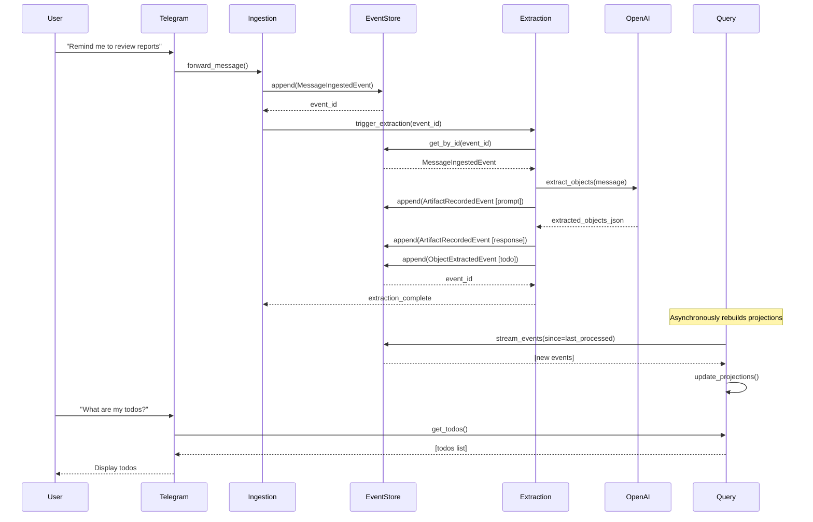
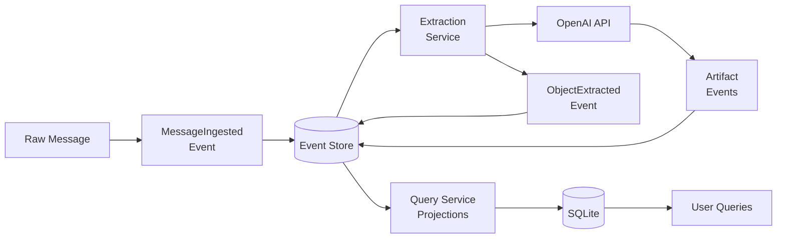
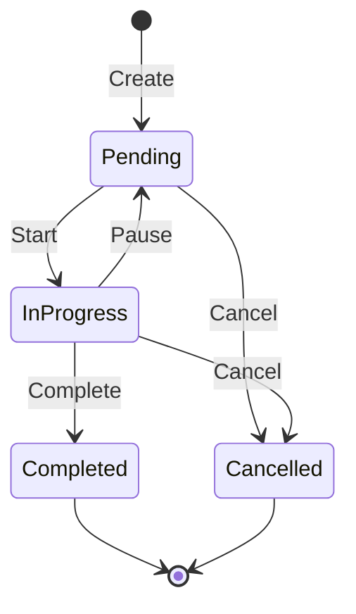
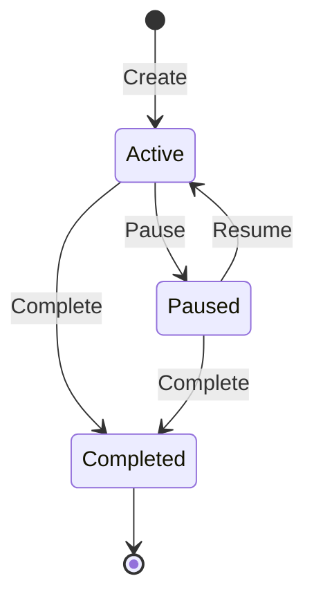

# Process Architecture: Message → Extraction → Query

**Status**: Active runtime flow  
**Primary scope**: ingestion, extraction, projections, queryability

## Purpose

Describe the canonical Helionyx pipeline from incoming message to durable,
queryable object state.

## Invariants

1. Event log is append-only source of truth.
2. Derived projections are rebuildable from event history.
3. Adapters contain no domain logic.
4. LLM prompts/responses are recorded as durable artifacts.

## Core Services in this Process

- **Ingestion Service**: normalize input and emit `MESSAGE_INGESTED`.
- **Extraction Service**: create structured objects and artifact events.
- **Query Service**: build/update SQLite projections from events.

## Canonical Flow

## Data Flow

## Lifecycle State Machines

### Todo

### Track

## Event Families Used

- `MESSAGE_INGESTED`
- `ARTIFACT_RECORDED`
- `OBJECT_EXTRACTED`
- `DECISION_RECORDED` (task lifecycle and audit semantics)

See full schemas: `shared/contracts/events.py` and `shared/contracts/objects.py`.

## Related Docs

- `docs/ADR/ADR_M1_LLM_INTEGRATION.md`
- `docs/ADR/ADR_M1_SQLITE_PERSISTENCE.md`
- `docs/ADR/ADR_M1_TELEGRAM_ARCHITECTURE.md`
