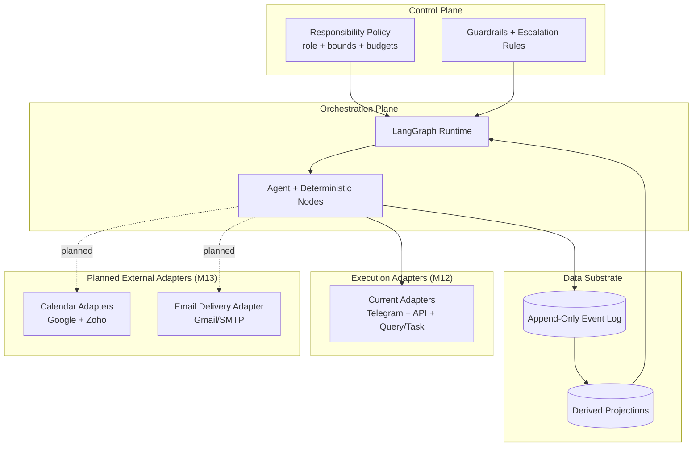
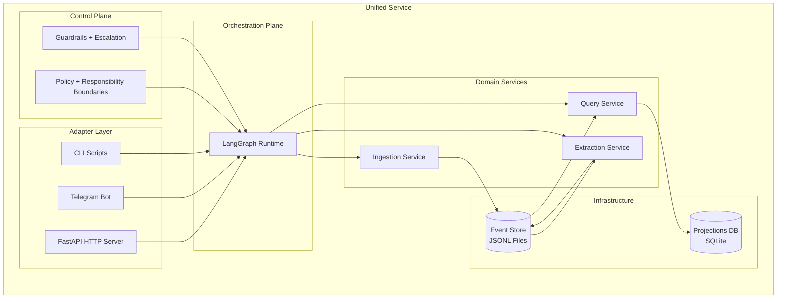

# Process Architecture: Orchestration + Control

**Status**: M12 implemented (LangGraph runtime active), M13-ready  
**Primary scope**: bounded agentic orchestration under deterministic policy control

## Purpose

Define how Helionyx combines:
- LangGraph orchestration (agentic sequencing)
- deterministic control policy (guardrails + fail-closed enforcement)
- append-only auditability (event substrate as source of truth)

## Invariants

1. Human authority is absolute.
2. Agent autonomy is valid only in declared bound
s.
3. Out-of-bounds actions fail closed and escalate.
4. Side effects execute through deterministic services/adapters.
5. Every meaningful run and decision is durably reconstructable.

## Planes and Responsibilities

### Orchestration Plane
- Coordinates graph execution (branch/retry/checkpoint/fallback).
- Selects in-bounds paths based on context and policy envelope.
- Delegates side effects to deterministic services.

### Control Plane
- Evaluates tool allowlists, side-effect scope, and budget constraints.
- Produces deterministic allow/deny/escalate outcomes.
- Emits explicit rationale for blocked/escalated actions.

### Data Substrate
- Persists run lifecycle, node transitions, and policy outcomes.
- Supports replay, forensics, and operator-facing explanation surfaces.

## System Relationship

## Component-Level View

## Policy Envelope Contract

Policy envelope shape and deterministic enforcement details are versioned in:
- `docs/CONTROL_PLANE_POLICY_CONTRACT.md`

## Audit Event Families (Active in M12)

- Orchestration run lifecycle (start/checkpoint/finish/failure)
- Node transition outcomes (entered/completed/retried/fallback)
- Policy outcomes (allowed/blocked/escalated with reason)
- Delivery outcomes (attempted/succeeded/failed with dedup fingerprint)

Primary contract and implementation anchors:
- `shared/contracts/events.py` (event schemas and types)
- `services/control/policy.py` (deterministic evaluator)
- `services/orchestration/runtime.py` (runtime boundary + event emission)
- `services/api/routes/control_room.py` (operator visibility)

## Operational Rule of Thumb

- Use LangGraph for sequencing and bounded reasoning.
- Use deterministic services for irreversible side effects and hard invariants.
- Ensure each run is explainable from durable evidence.
